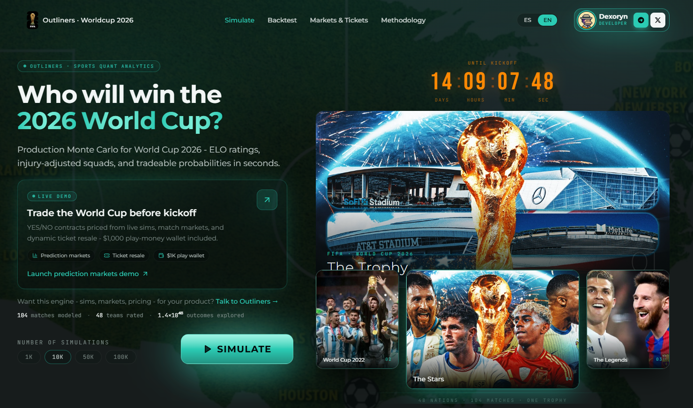

# Outliners · 2026 世界杯分析

[English](README.md) · [简体中文](README.zh-CN.md)

## 联系方式

想合作或一起做点什么？联系我。

**Telegram：** [t.me/dexoryn](https://t.me/dexoryn) | **Discord：** `dexoryn_` | **X：** [@dexoryn](https://x.com/dexoryn)

**在线演示：** [worldcup2026-prediction-market.vercel.app](https://worldcup2026-prediction-market.vercel.app/) · 英语（默认）· 西班牙语 [`/es`](https://worldcup2026-prediction-market.vercel.app/es)

---

面向 **2026  FIFA 世界杯** 的蒙特卡洛模拟器与交互式分析 — ELO + 泊松引擎、伤停调整阵容、预测市场 Demo 与博彩赔率对比。



> *灵感来自 [I Simulated the World Cup, and the US won](https://www.youtube.com/watch?v=w5NK7bPjQkw) — 相同核心思路，扩展了伤停、点球、市场 Demo 与历史回测。*

**在线应用：** [worldcup2026-prediction-market.vercel.app](https://worldcup2026-prediction-market.vercel.app/)  
**本地运行：** `npm run dev` → [http://localhost:3000](http://localhost:3000)  
**语言：** 英语（默认）· 西班牙语（`/es`）

---

## 功能

### 模拟器（首页）

- **蒙特卡洛引擎** — 在浏览器中通过 **Web Worker** 运行 **1K / 10K / 50K / 100K** 次完整赛事模拟（约 15–25K 次/秒）。
- **双次模拟** — 每次运行同时计算**含**与**不含**阵容缺席（伤病/停赛）的概率，便于对比对冠军赔率的影响。
- **丰富仪表盘**：
  - **预测变化** — 伤停如何改变强队概率
  - **冠军概率** — 含 Wilson 95% 置信区间，可切换有无伤停
  - **阶段矩阵** — 进入 32 强 / 16 强 / 8 强 / 半决赛 / 决赛 / 夺冠 %
  - **小组排名** — 各队预期名次分布
  - **对阵树** — 最可能的淘汰赛路径
  - **赛程日历** — 104 场比赛，含胜/平/负与比分分布（点击行查看详情）
  - **赛事与进球统计**、**冷门球队**、**与 Polymarket/Kalshi 的市场偏差**
- **球队与比赛抽屉** — ELO、缺席球员、阶段概率、比分热力图、射手
- **固定分区导航**、模拟完成彩带、首页图片画廊
- **移动端适配** — 汉堡菜单、可滚动表格、Demo 堆叠布局

### 预测市场 Demo（`/demo`）

使用**首页模拟结果**的模拟资金沙盒 — 打开 Demo 时无需再次运行模拟。

| 标签 | 功能 |
|------|------|
| **Markets** | 按模拟概率买卖冠军、小组第一、对阵 **YES/NO** 合约 |
| **Tickets** | 合成**二级市场**票务，含票面 / 公允 / 要价 |
| **Portfolio** | 现金、持仓、票务资产、结算记录 |

- **$1,000 模拟钱包**（保存在 `localStorage`）
- 根据模拟中随机抽样的赛事结果**结算市场**
- YES/NO 交易成功时**彩带**庆祝
- 筛选：全部 · 冠军 · 小组 · 比赛

### 回测（`/backtest`）

基于 **2014、2018、2022 世界杯** 的历史验证 — 校准分桶、主场优势扫描、近期状态融合与点球模型评估。

### 方法论（`/methodology`）

ELO 期望、泊松进球、淘汰赛点球（基于 103 场历史点球数据的贝叶斯收缩）、蒙特卡洛聚合、Wilson 置信区间及已知局限的完整说明。

### 界面亮点

- 首页：**「谁将赢得 2026 世界杯？」** 与实时模拟控件
- 每页顶栏**开发者联系卡片**（Dexoryn · Telegram · Discord · X）
- 页脚致谢 + **Dexorynlabs** 社交链接

---

## 技术栈

| 层级 | 技术 |
|------|------|
| 框架 | Next.js 15 · React 19 · TypeScript |
| 样式 | Tailwind CSS v4（OKLCH 色板，Outliners 品牌青绿） |
| 国际化 | next-intl（英语 / 西班牙语） |
| 动画 | GSAP · canvas-confetti |
| 图表 | D3 |
| 状态 | Zustand（选择抽屉） |
| 引擎 | 纯 TypeScript · xoshiro128\*\* PRNG · Web Worker |

**性能：** Node 约 35K 次/秒；浏览器 Worker 约 15–25K 次/秒。10 万次双次模拟通常 **约 5–10 秒**（视设备而定）。

**数据：** 2026  FIFA 官方抽签（2025 年 12 月 5 日）· ELO 来自 [eloratings.net](https://www.eloratings.net/) · 可选实时赔率 `/api/odds`

---

## 快速开始

```bash
npm install --legacy-peer-deps
npm run dev          # http://localhost:3000
npm run build        # 生产构建
npm test             # vitest
```

### 数据更新脚本

```bash
npm run scrape-elo       # 刷新国家队 ELO
npm run fetch-odds       # Polymarket / Kalshi 冠军赔率
npm run fetch-absences   # 阵容缺席（伤病、停赛）
npm run fetch-backtest   # 回测用历史世界杯数据
npm run fetch-results    # 实时赛果（ESPN）
npm run fetch-cards      # 黄牌累积数据
```

---

## 模型（简述）

### ELO 胜率期望

```
We = 1 / (10^(-dr/400) + 1)
dr = ELO_A − ELO_B + home_bonus   （小组赛东道主 +100）
```

### 进球（独立泊松）

```
λ_team = clamp(1.30 + 0.18 · (ELO_team − ELO_opp + home_bonus) / 100,  0.15,  6.0)
goals ~ Poisson(λ_team)
```

### 淘汰赛平局

常规时间平局 → 用历史点球率贝叶斯收缩建模**点球大战**（非抛硬币）。点球进球不计入进球统计。

### 缺席球员

关键球员缺阵（伤病/停赛）在每次抽签前对球队 ELO 施加惩罚。Worker 另跑一次**反事实**（无缺席）以便对比。

### 合理性检查

- 冠军概率之和为 **100%**（N 次模拟精确）
- 场均进球约 **2.6**（符合世界杯历史 2.5–2.7）
- 热门球队与 ELO / 博彩共识一致（西班牙、阿根廷、法国、巴西、葡萄牙）

完整说明见应用内 `/methodology`。

---

## 项目结构

```
src/
├── app/[locale]/           App Router 页面
│   ├── page.tsx            首页 · 模拟器 + 仪表盘
│   ├── demo/               预测市场与票务 Demo
│   ├── backtest/           历史模型验证
│   ├── methodology/        模型文档
│   └── api/odds/           实时市场赔率接口
├── components/
│   ├── demo/               DemoHub · MarketsTab · TicketsTab · PortfolioTab
│   ├── hero/               HeroGallery · HeroDemoPromo · MeshGradient
│   ├── layout/             Header · HeaderProfile · Footer · SectionNav
│   └── …                   仪表盘组件与抽屉
├── hooks/
│   ├── useSimulation.ts    共享 Web Worker + 模拟状态（跨页面保留）
│   └── useDemoWallet.ts    模拟钱包（localStorage）
├── i18n/messages/          es.json · en.json
├── lib/
│   ├── sim/                engine · tournament · group · knockout · absences · worker
│   ├── demo/               markets · tickets · cache · flags
│   ├── social.ts           Telegram、Discord 与 X 链接（顶栏 + 页脚）
│   └── confetti.ts         共享庆祝效果
├── data/                   teams.json · groups.json · bracket.json · absences · odds
└── scripts/                ELO 抓取 · 赔率 · 回测数据 · 评估扫描

public/
├── banner.png              README 横幅
├── worldcup1.jpg           首页奖杯图
├── Dexoryn.png             开发者头像（顶栏联系卡片）
├── logo-worldcup2026.webp
└── …                       画廊与品牌资源
```

---

## 路由

**生产环境：** [https://worldcup2026-prediction-market.vercel.app](https://worldcup2026-prediction-market.vercel.app)

| 路径 | 说明 | 链接 |
|------|------|------|
| `/` | 模拟 → 仪表盘（英语） | [打开](https://worldcup2026-prediction-market.vercel.app/) |
| `/es` | 首页（西班牙语） | [打开](https://worldcup2026-prediction-market.vercel.app/es) |
| `/demo` | 模拟资金市场与票务 | [打开](https://worldcup2026-prediction-market.vercel.app/demo) |
| `/backtest` | 2014 / 2018 / 2022 验证 | [打开](https://worldcup2026-prediction-market.vercel.app/backtest) |
| `/methodology` | 模型文档 | [打开](https://worldcup2026-prediction-market.vercel.app/methodology) |
| `/es/…` | 西班牙语前缀 | 例 [/es/demo](https://worldcup2026-prediction-market.vercel.app/es/demo) |

---

## 致谢与联系

想合作或一起做点什么？联系我。

**Telegram：** [t.me/dexoryn](https://t.me/dexoryn) | **Discord：** `dexoryn_` | **X：** [@dexoryn](https://x.com/dexoryn)

**数据与参考**  
ELO 评分 — [eloratings.net](https://www.eloratings.net/)  
官方抽签 — [2026 FIFA 世界杯](https://www.fifa.com/en/tournaments/mens/worldcup/canadamexicousa2026)  
参考方法 — [Luke Benz — World Cup simulation](https://www.youtube.com/watch?v=w5NK7bPjQkw)  
国旗图标 — [circle-flags](https://hatscripts.github.io/circle-flags/) (MIT)

---

## 许可证

私有 / 保留所有权利，除非仓库设置另有说明。
